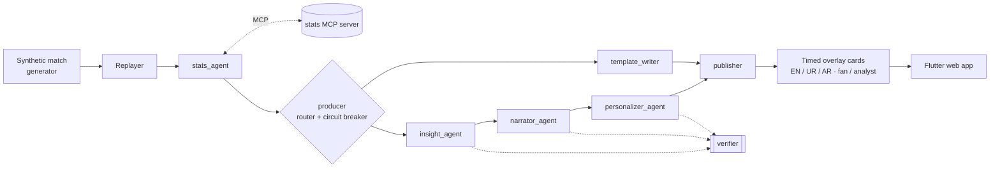

# MatchMind

**An AI broadcast booth for football.** A team of specialised agents turns a live stream of match
events into explainable match intelligence: live stats, "why it matters" insight cards,
commentary and a full-time recap, timed to sit on screen alongside the match and personalised
for each viewer (fan or analyst; English, Urdu or Arabic; favourite club and player).

**▶ Live demo:** https://alisaeed-1.github.io/matchmind/ (no install, no keys)

Built for the Microsoft "Inside the Game" Developer Hackathon (category: Best Multi-Agent
Orchestration). All clubs, players and matches are fictional and generated by this project.

## How it works



1. **Ingest**: a seeded generator produces realistic synthetic matches (~1,000 events each); the
   replayer streams them minute by minute. See [DATA_SCHEMA.md](docs/DATA_SCHEMA.md).
2. **Interpret**: a deterministic stats engine computes possession, pass difficulty, xG, a
   pressure index, momentum and a control-vs-chaos index, and detects key moments. Numbers are
   always computed in code, never by an LLM. See [METRICS.md](docs/METRICS.md).
3. **Explain**: the Insight agent explains why each moment matters; the Narrator adds live
   commentary and the recap.
4. **Render**: every output is a timed, machine-readable overlay card (`display_at_ms`,
   `duration_ms`, type, audience, language) shown over a live pitch view.
5. **Personalise**: the Personalizer rewrites each card for fans and analysts in English, Urdu
   and Arabic; in live mode, from the viewer's favourite club's point of view.

Agent roles, routing, shared state, handoffs and the four levels of failure recovery are in
[AGENTS.md](docs/AGENTS.md).

## Technology

- **Microsoft Agent Framework** (Python): orchestration workflow, agents with structured output,
  MCP client (`MCPStdioTool`)
- **Microsoft Foundry Local**: on-device LLM inference (`qwen2.5-1.5b`) in the provider chain
- **Model Context Protocol**: the stats engine is an MCP server any MCP client can use
- **FastAPI + WebSocket** live API; **Flutter web** front end
- **GitHub Actions**: CI (ruff + pytest, flutter analyze + test) and GitHub Pages deployment
- Google Gemini free API (optional) for text quality, first in the provider chain

## Run it

Demo mode needs nothing but a browser: https://alisaeed-1.github.io/matchmind/

Backend (requires [uv](https://docs.astral.sh/uv/); optionally a free `GEMINI_API_KEY` in `.env`
and/or [Foundry Local](https://learn.microsoft.com/azure/foundry-local/)):

```bash
cp .env.example .env
cd backend
uv sync
uv run pytest -q                                   # 145+ tests
uv run uvicorn matchmind.api.app:app               # live API on :8000
uv run python -m matchmind.bake --match mm-0004-comeback   # re-bake a demo bundle
uv run python -m matchmind.generator --seed 7 --story comeback  # new synthetic match
```

Web app (requires Flutter 3.32+): see [frontend/README.md](frontend/README.md). Choose
**Live agents** to watch the agent team run against the local API, including a
"simulate model outage" switch in the debug drawer.

## Docs

| Doc | What's in it |
|---|---|
| [AGENTS.md](docs/AGENTS.md) | Agent roles, routing, shared state, handoffs, failure recovery, MCP |
| [METRICS.md](docs/METRICS.md) | Every stat formula and its calibration |
| [DATA_SCHEMA.md](docs/DATA_SCHEMA.md) | Synthetic data format and the simulator |
| [SUBMISSION.md](docs/SUBMISSION.md) | Pitch, Microsoft tech used, judge testing instructions |
| [DEMO_SCRIPT.md](docs/DEMO_SCRIPT.md) | The under-2-minute demo video script |
| [PLAN.md](docs/PLAN.md) | Plan, progress and engineering findings |
