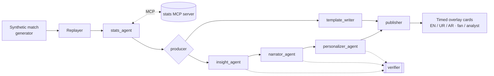

# MatchMind

An AI broadcast booth for football. A team of specialised agents turns a live stream of
match events into explainable match intelligence: live stats, "why it matters" insight cards,
commentary and a full-time recap, timed to sit on screen alongside the match and personalised
for each viewer (fan or analyst; English, Urdu or Arabic).

Built for the Microsoft "Inside the Game" Developer Hackathon. All clubs, players and matches
are fictional and generated by this project. No real league data is used.

> Work in progress. See [docs/PLAN.md](docs/PLAN.md).

## How it works



1. **Ingest**: a seeded generator produces realistic synthetic matches (~1,000 events each);
   the replayer streams them minute by minute. See [DATA_SCHEMA.md](docs/DATA_SCHEMA.md).
2. **Interpret**: a deterministic stats engine computes possession, pass difficulty, xG, a
   pressure index, momentum and a control-vs-chaos index, and detects key moments. Numbers are
   always computed in code, never by an LLM. See [METRICS.md](docs/METRICS.md).
3. **Explain**: the Insight agent explains why each moment matters; the Narrator adds live
   commentary and the recap.
4. **Render**: every output is a timed, machine-readable overlay card (`display_at_ms`,
   `duration_ms`, type, audience, language).
5. **Personalise**: the Personalizer rewrites each card for fans and analysts in English, Urdu
   and Arabic, and in live mode from the viewer's favourite club's point of view.

Agent roles, routing, shared state, handoffs and the four levels of failure recovery are
described in [AGENTS.md](docs/AGENTS.md).

## Technology

- **Microsoft Agent Framework** (Python): the orchestration workflow, agents, structured output,
  and the MCP client (`MCPStdioTool`)
- **Microsoft Foundry Local**: on-device LLM inference (`qwen2.5-1.5b`), no cloud account needed
- **Model Context Protocol**: the stats engine is an MCP server any MCP client can use
- **GitHub Actions**: lint and tests on every push
- Google Gemini free API (optional): higher-quality text, first in the provider chain when a
  key is set; Foundry Local is the fallback

## Quick start (backend)

Requires [uv](https://docs.astral.sh/uv/) and, for local inference,
[Foundry Local](https://learn.microsoft.com/azure/foundry-local/) (`winget install Microsoft.FoundryLocal`).

```bash
cp .env.example .env          # optional: add a free GEMINI_API_KEY
cd backend
uv sync
uv run pytest -q                                              # 130+ tests
uv run python -m matchmind.generator --seed 7 --story comeback # generate a match
uv run python -m matchmind.bake --match mm-0004-comeback       # run the agent team on it
```

Without a Gemini key the agents run on Foundry Local. The first run downloads the model
(about 1.5 GB) and loads it, which takes a few minutes on CPU. `--no-llm` bakes with templates
only, instantly.
