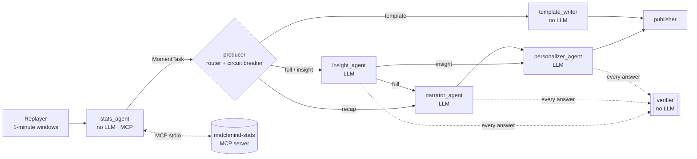

# Agents and orchestration

MatchMind is an AI broadcast booth: a team of specialised agents turns a stream of match
events into timed overlay cards for each viewer. The orchestration is a
**Microsoft Agent Framework workflow** (`backend/src/matchmind/agents/orchestrator.py`) that runs
once per minute of match play.



## Roles

| Agent | Uses an LLM? | Job | Output |
|---|---|---|---|
| **stats_agent** | No | Ingests events, asks the **stats MCP server** for the snapshot and key moments, builds FACTS for each new moment | `MomentTask` |
| **producer** | No | Decides how much of the team each moment deserves (see Routing); trips the circuit breaker | routed `MomentTask` |
| **insight_agent** | Yes | Explains *why* the moment matters: momentum, pressing, control vs chaos, chance quality | `InsightOut {title, explanation, why_it_matters}` |
| **narrator_agent** | Yes | Live commentary line; full-time recap | `CommentaryOut`, `RecapOut` |
| **personalizer_agent** | Yes | Rewrites the card for each audience (fan / analyst) and language (English, Urdu, Arabic); in live mode, from the viewer's favourite club's point of view | `PersonalizedOut {variants[]}` |
| **verifier** | No | Checks every LLM answer: numbers must come from FACTS, no players from outside the match, right script, overlay-sized text | list of problems |
| **template_writer** | No | Deterministic EN/UR/AR cards for low-importance moments and for recovery | cards |
| **publisher** | No | Writes cards to the shared state and emits them as workflow output | `CardBatch` |

**Why several agents and not one prompt?** The jobs need different inputs and are judged by
different standards. Numbers come from code (stats_agent) so they can't be hallucinated. Insight
must be accurate and analytical, commentary must be emotional, and personalization must hit 6
audience × language combinations, each checked separately. Splitting them means each prompt is
small enough for a 1.5B local model, each step is verified on its own, and a failure in one step
(say, Arabic personalization) doesn't throw away the others.

## Shared state

All agents read and write one `MatchState` (`backend/src/matchmind/state.py`): the events so far,
the latest stats snapshot, the moments detected, the published cards, the full-time recap,
counters, and the **handoff log**. Agents never call each other directly. The workflow passes
small typed messages (`MomentTask`, `Draft`, `CardBatch`) along its edges, and everything else
lives in the state.

## Handoffs

Every edge the workflow takes and every model attempt is recorded as a `Handoff`:

```json
{"seq": 412, "match_ms": 3534000, "source": "insight_agent", "target": "verifier",
 "moment_id": "goal:e00612", "status": "retry",
 "detail": "rejected: body uses numbers not in FACTS: 0.31", "provider": "gemini:gemini-3.5-flash",
 "latency_ms": 5123}
```

Statuses: `ok`, `retry` (bad JSON or verifier rejection), `provider_fallback` (model unavailable,
next one tried), `fallback` (all models failed, template used), `skipped` (routed to template),
`cached`. The demo bundle includes the whole log; the app's debug drawer shows it live.

## Routing (producer)

| Condition | Route | Agents used |
|---|---|---|
| Full time | `recap` | narrator → personalizer |
| importance ≥ 0.6 (goal, red card, big chance, momentum shift, half time) | `full` | insight → narrator → personalizer |
| 0.45 ≤ importance < 0.6 (pressure surge, chaos spell) | `insight` | insight → personalizer |
| importance < 0.45 (milestones, yellow cards, subs, elite pass, top speed) | `template` | template_writer |
| circuit breaker open and importance < 0.9 | `template` | template_writer |

This spends LLM time where it changes the viewer's understanding. On a laptop CPU, where one
local call takes 7–60 s, it is what makes live mode feasible.

## Failure recovery

Recovery happens at four levels, and each one is logged:

1. **Retry with feedback.** Malformed JSON, a schema mismatch or a verifier rejection sends the
   problems back to the *same* model for one more try ("body uses numbers not in FACTS: 0.31").
2. **Provider fallback.** 429 / 503 / timeouts back off and retry, then move down the chain
   (`gemini-3.5-flash` → `gemini-flash-lite-latest` → **Foundry Local** on-device). A provider that
   fails transiently is cooled down for 60 s so it doesn't cost a timeout on every call.
3. **Template fallback.** If every provider fails, the agent hands off to the template writer.
   The card is still correct (all numbers come from FACTS) and is marked `fallback_used`.
   Unverified LLM text is never published.
4. **Circuit breaker.** After 3 consecutive all-provider failures, the producer routes the next 6
   non-critical moments straight to templates, so a dead network doesn't add minutes of timeouts.
   Goals and red cards (importance ≥ 0.9) still try the LLM.

Tested in `backend/tests/test_orchestrator.py` with a fake model that can slip in a wrong number
or simulate a total outage.

## MCP

The stats engine is exposed as an MCP server (`backend/src/matchmind/mcp_server.py`, FastMCP over
stdio) with tools `list_matches`, `match_snapshot`, `key_moments`, `player_stats`,
`momentum_timeline` and `explain_event`. Each takes `until_ms`, so a client only ever sees the
match up to "now". The stats_agent calls it through Agent Framework's `MCPStdioTool`. The same
server works from any MCP client, for example Claude Desktop or VS Code:

```json
{"mcpServers": {"matchmind-stats": {
  "command": "uv", "args": ["--directory", "<repo>/backend", "run", "python", "-m", "matchmind.mcp_server"]}}}
```

## LLM providers

| Provider | How | Why |
|---|---|---|
| Google Gemini (free key) | `OpenAIChatCompletionClient` → OpenAI-compatible endpoint | Best quality, good Urdu/Arabic; used to bake the demo |
| **Microsoft Foundry Local** | On-device `qwen2.5-1.5b`, via a small adapter over Foundry Local SDK 2.x | No account, no quota, works offline; last line before templates |

Every call goes through an Agent Framework `Agent` with `response_format=<Pydantic model>`
(structured output) inside `LLMGateway` (`backend/src/matchmind/llm/gateway.py`).
